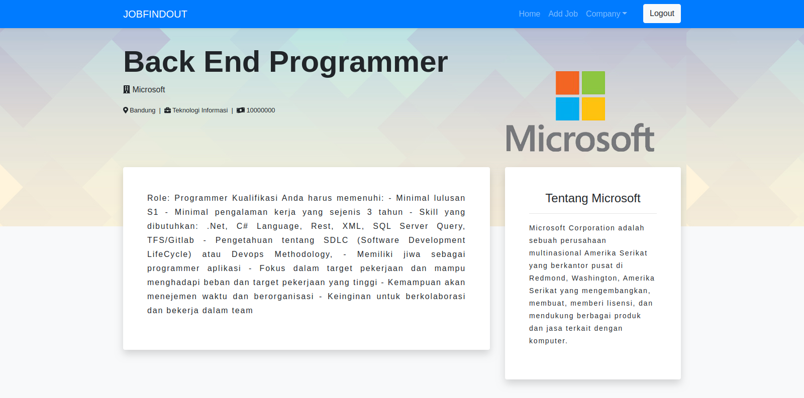

## Introduction

This is my personal project to pass bootcamp second and third task and this is front end for my github repesitory (restful-jobposting). This is open source and feel free to use and bought me.

## Screenshots

Home / Job List

Job Detail

Edit

## Prerequiste

-   Node.js
-   Yarn

## Installation

### Clone

    $ git clone https://github.com/nukumalik/react-jobposting.git
    $ cd react-jobposting
    $ npm install

### Start Development Server

    $ yarn start

### Other Depedencies

-   @fortawesome/fontawesome-free
-   axios
-   bootstrap
-   jquery
-   react-router-dom
-   redux
-   react-redux
-   redux-logger
-   redux-promise-middleware
